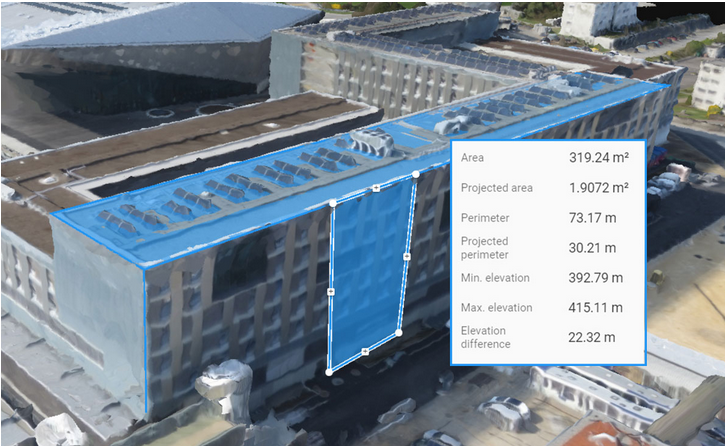
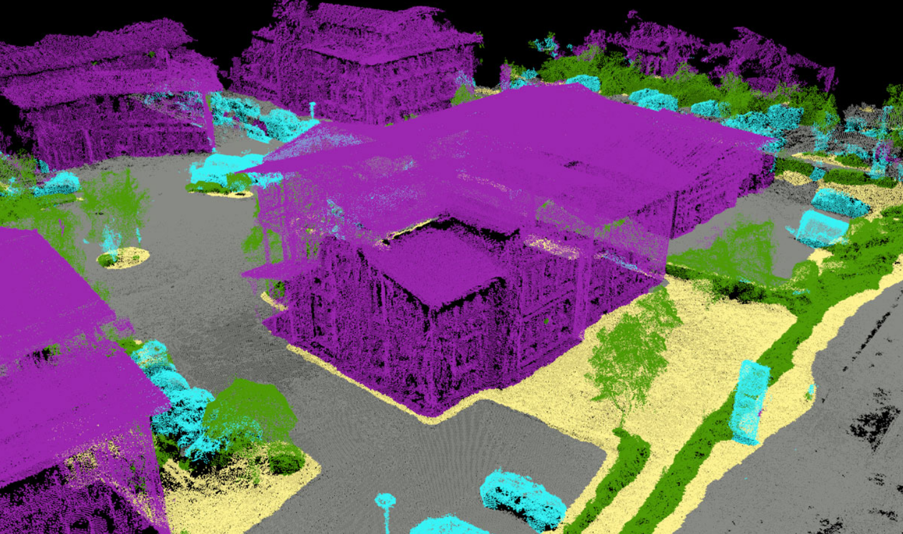
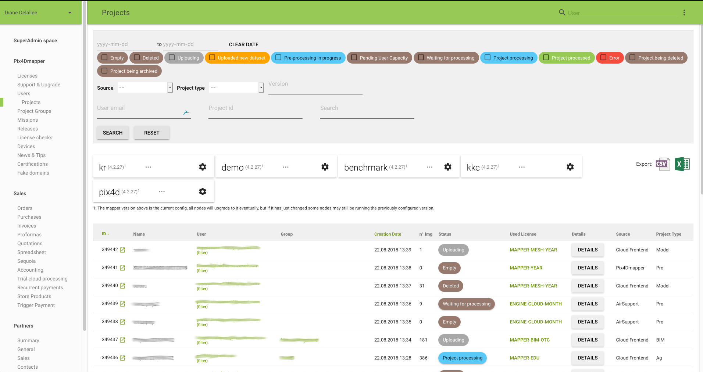
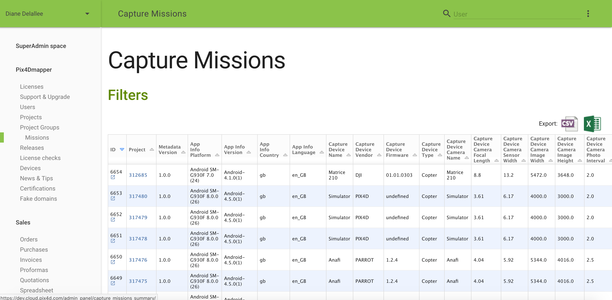

import { Head } from 'mdx-deck'

export { swiss as theme } from 'mdx-deck/themes'

<Head>
  <title>Coding club des filles</title>
</Head>

# Bonjour

Je m'appelle Diane Delallée 👩🏻‍💻 


---

## Qui suis-je

28 ans<br/>
📚 Master en Sciences de l'image a Paris<br/>
💙 ce que j'aime: 
* résoudre des problèmes
* aider les autres
* aller voir des concerts
* sortir avec mes ami·e·s


```notes
- résoudre des problèmes ->  en informatique on appelle ca l'algorithmique
c'est par exemple trouver comment on modifie plusieurs fichier d'un coup, ou comment on automatise certaines taches qu'on a pas envie de faire tous les jours.
```

---

## Loisirs

  Bénévole
<br/>
<br/>
 💻  Développe des sites web
<br/><br/>
  Projet personnel 

---

## Travail  


🚁 <small>drone pour modeliser des terrains et faire des calculs</small>

 <center>  </center>

 
 
---

Outils pour aider notre support a répondre au client

   
 